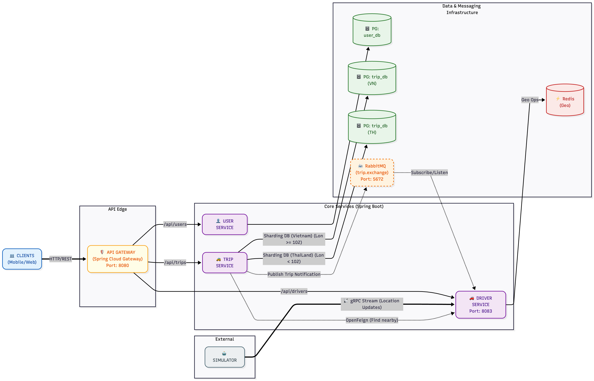
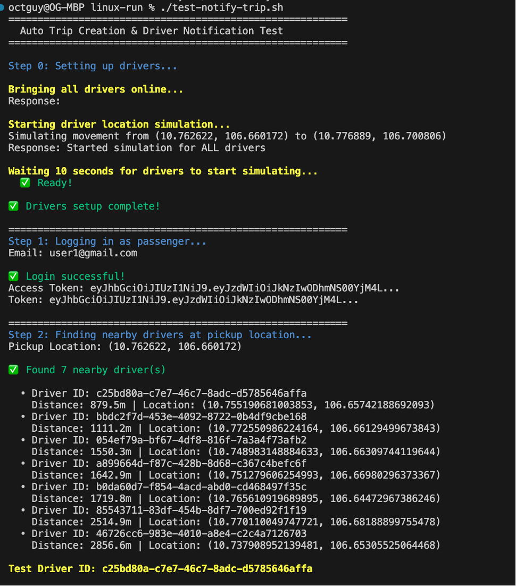
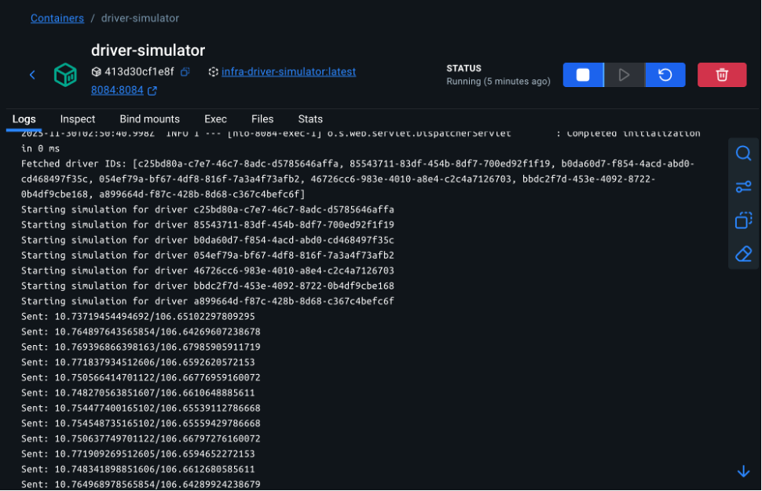
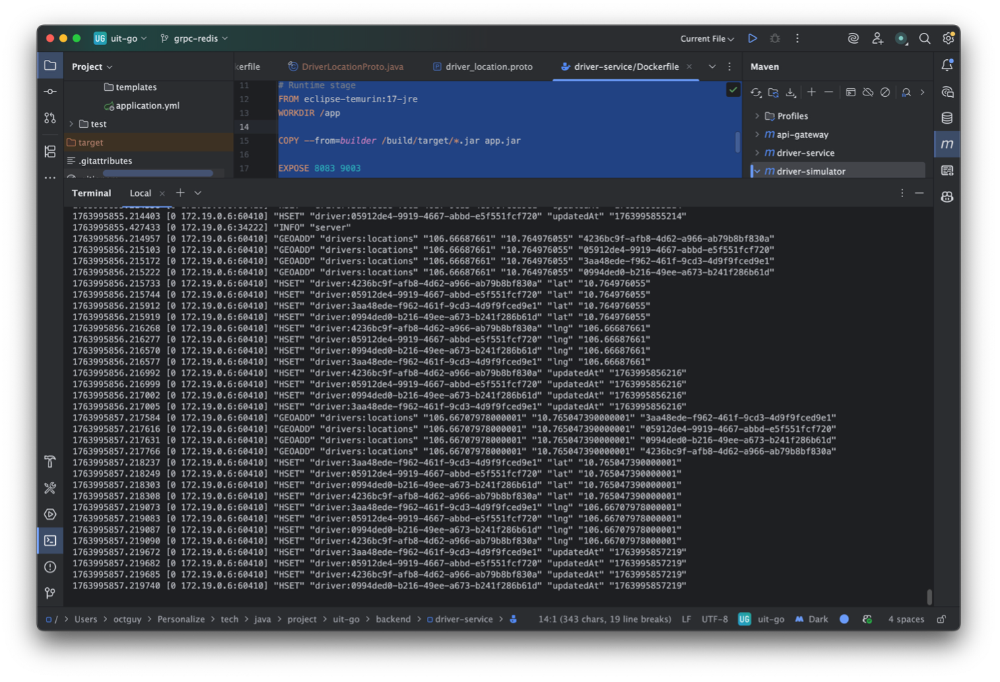
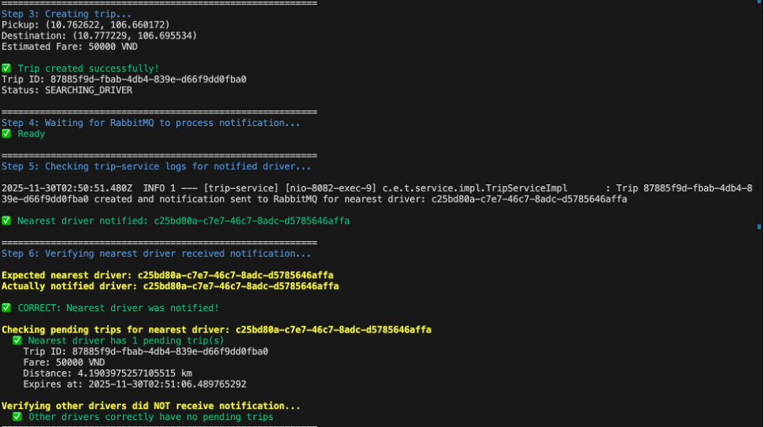
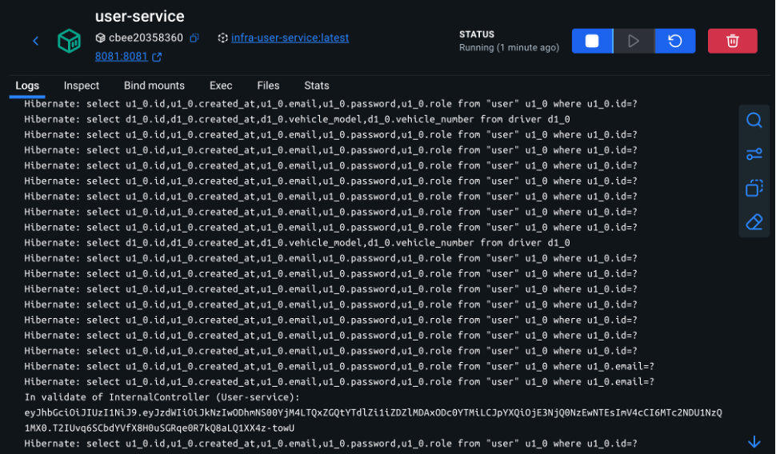
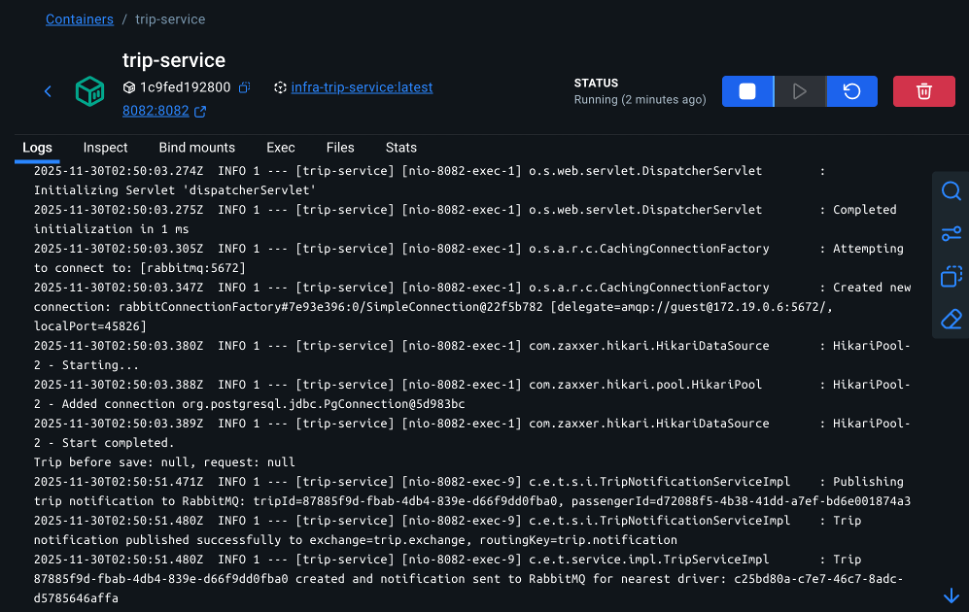
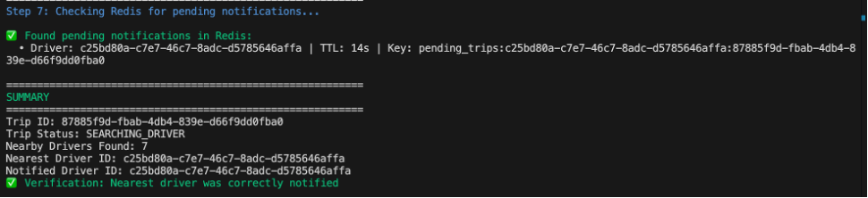

# UIT-Go - Hệ thống Đặt xe Microservices

Nền tảng đặt xe dựa trên kiến trúc microservices được xây dựng bằng Spring Boot, gRPC, PostgreSQL, Redis, RabbitMQ và Docker.

## Mục lục

- [Tổng quan Hệ thống](#tổng-quan-hệ-thống)
- [Kiến trúc](#kiến-trúc)
- [Yêu cầu Cài đặt](#yêu-cầu-cài-đặt)
- [Cấu trúc Dự án](#cấu-trúc-dự-án)
- [Cài đặt](#cài-đặt)
- [Chạy Hệ thống](#chạy-hệ-thống)
- [API Endpoints](#api-endpoints)
- [Truy cập Database](#truy-cập-database)
- [Kiểm thử API](#kiểm-thử-api)
- [Xử lý Sự cố](#xử-lý-sự-cố)
- [Quy trình Phát triển](#quy-trình-phát-triển)

## Tổng quan Hệ thống

UIT-Go là hệ thống đặt xe microservices toàn diện, triển khai các patterns cloud-native hiện đại với giao thức truyền thông hybrid (REST + gRPC + RabbitMQ).

### Các Microservices

- **User Service** (Port 8081) - Quản lý người dùng, xác thực và phân quyền
- **Trip Service** (Port 8082) - Đặt chuyến đi, tính giá cước, database sharding theo địa lý
- **Driver Service** (Port 8083) - Quản lý tài xế, theo dõi vị trí real-time với Redis Geospatial
- **Driver Simulator** (Port 8084) - Mô phỏng vị trí tài xế theo thời gian thực
- **API Gateway** (Port 8080) - **Điểm truy cập duy nhất** với định tuyến thông minh

### Thành phần Hạ tầng

- **PostgreSQL** - Database riêng biệt cho từng service (database-per-service pattern)
  - User Service DB (Port 5435)
  - Trip Service DB - VN Shard (Port 5433)
  - Trip Service DB - TH Shard (Port 5434)
- **Redis** (Port 6379) - Geospatial data cho vị trí tài xế và notification storage
- **RabbitMQ** (Port 5672, Management UI: 15672) - Message broker cho thông báo chuyến đi bất đồng bộ
- **Docker** - Containerization hoàn chỉnh với Docker Compose
- **gRPC** (Port 9092) - Inter-service communication hiệu năng cao cho cập nhật vị trí

## Kiến trúc

### Patterns Truyền thông

- **REST APIs**: Client-facing endpoints qua API Gateway (Port 8080)
- **gRPC Client Streaming**: Cập nhật vị trí tài xế real-time (Driver Simulator → Driver Service)
- **RabbitMQ**: Async messaging cho thông báo chuyến đi (Trip Service → Driver Service)
- **OpenFeign**: Declarative HTTP client cho service-to-service calls
- **Redis GEO Commands**: Truy vấn geospatial cho vị trí tài xế

### Sơ đồ Kiến trúc



### Quyết định Kiến trúc (ADR)

Dự án có các Architecture Decision Records chi tiết:

- **[ADR-001: Redis cho Geospatial](docs/ADR/001-redis-vs-dynamodb-for-geospatial.md)** -
- **[ADR-002: gRPC cho Location Updates](docs/ADR/002-grpc-vs-rest-for-location-updates.md)**
- **[ADR-003: REST cho CRUD Operations](docs/ADR/003-rest-vs-grpc-for-crud-operations.md)**
- **[ADR-004: RabbitMQ cho Async Messaging](docs/ADR/004-rabbitmq-vs-kafka-for-async-messaging.md)**
- **[ADR-005: Geographic Sharding vs Hash-based Sharding cho Trip Database](docs/ADR/005-geographic-sharding-vs-hash-sharding.md)**
- **[ADR-006: Redis Read Replicas vs Redis Cluster cho Driver Location Scaling](docs/ADR/006-redis-replicas-vs-cluster.md)**
- **[ADR-007: HPA vs VPA cho Kubernetes Autoscaling](docs/ADR/007-hpa-vs-vpa-autoscaling.md)**
- **[ADR-008: Linkerd vs Istio cho Service Mesh](docs/ADR/008-linkerd-vs-istio.md)**
- **[ADR-009: Resilience4j vs Hystrix cho Circuit Breaker Pattern](docs/ADR/009-resilience4j-vs-hystrix.md)**
- **[ADR-010: k6 vs JMeter cho Load Testing](docs/ADR/010-k6-vs-jmeter.md)**

## Yêu cầu Cài đặt

### Bắt buộc (để chạy với Docker)

- **Docker Desktop** 20.10+ (bao gồm Docker Compose) và ít nhất **4GB** memory
  ```bash
  docker --version
  docker compose version  # hoặc docker-compose --version
  ```
- **Git** - Để clone repository

### Tùy chọn (để phát triển local ngoài Docker)

- **Java 17** hoặc cao hơn
  ```bash
  java -version
  ```
- **Maven 3.6+** (Maven Wrapper đã có sẵn trong mỗi service)
- **Postman** hoặc **curl** - Kiểm thử API
- **psql** hoặc **DBeaver** - Quản lý database
- **Redis CLI** - Kiểm tra và debug Redis

## Cấu trúc Dự án

```
uit-go/
├── backend/
│   ├── api-gateway/        # Spring Cloud Gateway (Port 8080)
│   │   ├── src/
│   │   ├── pom.xml
│   │   ├── Dockerfile
│   │   └── mvnw/mvnw.cmd
│   ├── user-service/       # Quản lý người dùng (Port 8081)
│   │   ├── src/main/java/com/example/user_service/
│   │   │   ├── controller/  # REST controllers
│   │   │   ├── service/     # Business logic
│   │   │   ├── repository/  # Data access
│   │   │   ├── entity/      # JPA entities
│   │   │   ├── jwt/         # JWT authentication
│   │   │   └── config/      # Security & CORS config
│   │   ├── pom.xml
│   │   └── Dockerfile
│   ├── trip-service/       # Quản lý chuyến đi (Port 8082)
│   │   ├── src/main/java/com/example/trip_service/
│   │   │   ├── controller/  # REST controllers
│   │   │   ├── service/     # Business logic
│   │   │   ├── repository/  # Multi-datasource (VN/TH sharding)
│   │   │   ├── entity/      # JPA entities
│   │   │   ├── config/      # OpenFeign clients, RabbitMQ, DB routing
│   │   │   └── client/      # OpenFeign interfaces
│   │   ├── pom.xml
│   │   └── Dockerfile
│   ├── driver-service/     # Quản lý tài xế (Port 8083, gRPC: 9092)
│   │   ├── src/main/
│   │   │   ├── java/com/example/driver_service/
│   │   │   │   ├── controller/  # REST controllers
│   │   │   │   ├── service/     # Business logic, Redis Geo
│   │   │   │   ├── grpc/        # gRPC service implementation
│   │   │   │   ├── listener/    # RabbitMQ listener
│   │   │   │   └── config/      # Redis, gRPC, RabbitMQ config
│   │   │   └── proto/       # Protocol Buffer definitions
│   │   ├── pom.xml
│   │   └── Dockerfile
│   └── driver-simulator/   # Mô phỏng vị trí (Port 8084)
│       ├── src/main/java/com/example/driver_simulator/
│       │   ├── controller/  # Simulator REST API
│       │   ├── simulate/    # Path generation logic
│       │   └── config/      # gRPC client config
│       ├── pom.xml
│       └── Dockerfile
├── infra/
│   ├── docker-compose.yml  # Orchestration hoàn chỉnh
│   └── k8s/               # Kubernetes deployment files (optional)
├── schema/                 # Database initialization scripts
│   ├── user-schema.sql
│   └── trip-schema.sql
├── linux-run/              # Scripts tự động hóa cho macOS/Linux
│   ├── start.sh           # Khởi động nhanh tất cả services
│   └── stop.sh            # Dừng tất cả containers
├── win-run/                # Scripts tự động hóa cho Windows
│   ├── rebuild-all.bat
│   ├── restart-docker.bat
│   └── demo-service-integration.bat
└── docs/                   # Tài liệu chi tiết
    ├── ARCHITECTURE.md     # Kiến trúc hệ thống (Tiếng Việt)
    ├── ADR/               # Architecture Decision Records
    │   ├── 001-redis-vs-dynamodb-for-geospatial.md
    │   ├── 002-grpc-vs-rest-for-location-updates.md
    │   ├── 003-rest-vs-grpc-for-crud-operations.md
    │   └── 004-rabbitmq-vs-kafka-for-async-messaging.md
    └── testing-guide/
        ├── API_ENDPOINTS.md
        └── redis-grpc-testing-commands.md
```

## Cài đặt

Làm theo các bước sau để cài đặt và chạy toàn bộ hệ thống với Docker:

1. **Clone repository**

   ```bash
   git clone https://github.com/octguy/uit-go.git
   cd uit-go
   ```

2. **Khởi động Docker Desktop** và xác nhận đang chạy:

   ```bash
   docker ps
   ```

3. **Chạy script tự động build + start**

   **macOS/Linux:**

   ```bash
   cd linux-run
   chmod +x start.sh stop.sh
   ./start.sh
   ```

   **Windows (PowerShell hoặc Command Prompt):**

   ```cmd
   cd win-run
   rebuild-all.bat
   ```

   Scripts này sẽ:

   - Dừng các containers cũ
   - Build tất cả service images (sử dụng Maven wrapper trong Docker)
   - Khởi động toàn bộ stack
   - Hiển thị trạng thái containers

4. **Xác minh hệ thống**

   ```bash
   cd infra
   docker-compose ps          # Trạng thái containers
   docker-compose logs --tail=50 api-gateway  # Logs mẫu
   ```

5. **Dừng khi hoàn thành**
   ```bash
   cd infra
   docker-compose down        # Giữ data volumes
   # Hoặc để reset toàn bộ (bao gồm dữ liệu Postgres/Redis):
   docker-compose down -v
   ```

> **Lưu ý**: Nếu muốn build ngoài Docker, Maven wrapper nằm trong mỗi service (ví dụ: `backend/user-service/mvnw`).

## Chạy Hệ thống

### Khởi động Nhanh với Docker (Khuyến nghị)

**macOS/Linux:**

```bash
cd linux-run && ./start.sh
```

**Windows:**

```bash
cd win-run && rebuild-all.bat
```

**Script này thực hiện:**

- Dừng tất cả containers UIT-Go đang chạy
- Build fresh images cho mọi service
- Khởi động toàn bộ stack với Docker Compose
- Hiển thị containers đang chạy và endpoints chính

### Khởi động Thủ công với Docker Compose

```bash
cd infra
docker-compose up -d --build   # Build images và start
docker-compose ps              # Kiểm tra trạng thái
docker-compose logs -f         # Xem tất cả logs
docker-compose logs -f user-service  # Xem logs một service
docker-compose down            # Dừng (giữ data)
docker-compose down -v         # Dừng và xóa data volumes
```

### Phát triển Service Riêng lẻ

Chạy một service đơn lẻ local (không dùng Docker) để phát triển:

```bash
# Di chuyển đến thư mục service
cd backend/user-service

# Chạy với Maven wrapper (macOS/Linux)
./mvnw spring-boot:run

# Chạy với Maven wrapper (Windows)
mvnw.cmd spring-boot:run
```

**Lưu ý**: Khi chạy services locally, đảm bảo:

- Databases PostgreSQL có thể truy cập được (qua Docker hoặc cài đặt local)
- Redis đang chạy (cho Driver Service)
- Cập nhật `application.yml` với connection strings đúng

## API Endpoints

### 🔑 Quan trọng: TẤT CẢ requests từ client PHẢI đi qua API Gateway (Port 8080)

### Ports của Services

| Service          | HTTP Port | gRPC Port | URL qua Gateway           | URL trực tiếp (chỉ internal)     |
| ---------------- | --------- | --------- | ------------------------- | -------------------------------- |
| **API Gateway**  | **8080**  | -         | **http://localhost:8080** | **← SỬ DỤNG PORT NÀY**           |
| User Service     | 8081      | -         | Qua Gateway               | http://localhost:8081 (internal) |
| Trip Service     | 8082      | -         | Qua Gateway               | http://localhost:8082 (internal) |
| Driver Service   | 8083      | 9092      | Qua Gateway               | http://localhost:8083 (internal) |
| Driver Simulator | 8084      | -         | http://localhost:8084     | http://localhost:8084 (testing)  |
| Redis            | 6379      | -         | http://localhost:6379     | -                                |
| RabbitMQ UI      | 15672     | -         | http://localhost:15672    | guest/guest                      |

### Health Checks

Kiểm tra tất cả services đang chạy:

```bash
# Qua API Gateway
curl http://localhost:8080/actuator/health

# Kiểm tra từng service trực tiếp
curl http://localhost:8081/actuator/health  # User Service
curl http://localhost:8082/actuator/health  # Trip Service
curl http://localhost:8083/actuator/health  # Driver Service
curl http://localhost:8084/actuator/health  # Driver Simulator
```

### Endpoints API Chính (QUA API GATEWAY - PORT 8080)

**Tất cả requests đi qua: `http://localhost:8080`**

#### I. Quản lý Người dùng (User Service)

##### 1. Đăng ký người dùng (api/users/register)

###### Example request

```json
{
  "email": "user1@gmail.com",
  "password": "123456"
}
```

###### Example response

```json
{
  "id": "38eebcb1-fd83-45e7-8fd2-9a82056f4f9e",
  "email": "user1@gmail.com",
  "role": "ROLE_USER",
  "createdAt": "2025-11-30T01:52:44.487335178"
}
```

###### Test cURL

```bash
curl -s -X POST http://localhost:8080/api/users/register \
  -H 'Content-Type: application/json' \
  -d "{
    \"email\": \"user1@gmail.com\",
    \"password\": \"123456\"
  }"
```

##### 2. Đăng ký tài xế (api/users/register-driver)

###### Example request

```json
{
  "email": "driver1@gmail.com",
  "password": "123456",
  "vehicleModel": "Maybach S450",
  "vehicleNumber": "51ABCD"
}
```

###### Example response

```json
{
  "id": "a899664d-f87c-428b-8d68-c367c4befc6f",
  "email": "driver1@gmail.com",
  "vehicleModel": "Maybach S450",
  "vehicleNumber": "51ABCD",
  "createdAt": "2025-11-30T01:59:15.918547804"
}
```

###### Test cURL

```bash
curl -s -X POST http://localhost:8080/api/users/register \
  -H 'Content-Type: application/json' \
  -d "{
    \"email\": \"driver1@gmail.com\",
    \"password\": \"123456\",
    \"vehicleModel\": \"Maybach S450\",
    \"vehicleNumber\": \"51ABCD\"
  }"
```

##### 3. Đăng nhập (cho user và driver) (api/users/login)

###### Example request

```json
{
  "email": "user1@gmail.com",
  "password": "123456"
}
```

###### Example response

```json
{
  "accessToken": "eyJhbGciOiJIUzI1NiJ9.eyJzdWIiOiJkNzIwODhmNS00YjM4LT..."
}
```

###### Test cURL

```bash
curl -s -X POST http://localhost:8080/api/users/login \
  -H 'Content-Type: application/json' \
  -d "{
    \"email\": \"user1@gmail.com\",
    \"password\": \"123456\"
  }"
```

##### 3. Fetch thông tin người dùng (api/users/me)

###### Example response

```json
{
  "id": "d72088f5-4b38-41dd-a7ef-bd6e001874a3",
  "email": "user1@gmail.com",
  "role": "ROLE_USER",
  "createdAt": "2025-11-27T18:20:43.901194"
}
```

###### Test cURL

```bash
curl -X GET "http://localhost:8080/api/users/me" \
  -H "Authorization: Bearer YOUR_ACCESS_TOKEN"

```

#### II. Quản lý chuyến đi (Trip Service)

##### 1. Ước tính giá cước (api/trips/estimate-fare)

###### Example request

```json
{
  "pickupLatitude": 10.762622,
  "pickupLongitude": 106.660172,
  "destinationLatitude": 10.779783,
  "destinationLongitude": 106.699181
}
```

###### Example response

```json
{
  "fare": 900,
  "distance": 4.668933885013943
}
```

###### Test cURL

```bash
curl -s -X POST http://localhost:8080/api/trips/estimate-fare \
  -H 'Content-Type: application/json' \
  -H 'Authorization: Bearer YOUR_ACCESS_TOKEN' \
  -d "{
    \"pickupLatitude\": 10.762622,
    \"pickupLongitude\": 106.660172,
    \"destinationLatitude\": 10.779783,
    \"destinationLongitude\": 106.699181
  }"
```

##### 2. Tạo chuyến đi (api/trips/create)

###### Example request

```json
{
  "pickupLatitude": 10.762622,
  "pickupLongitude": 106.660172,
  "destinationLatitude": 10.779783,
  "destinationLongitude": 106.699181,
  "estimatedFare": 50000
}
```

###### Example response

```json
{
  "id": "f537dc54-670d-48f9-aac0-f2d3245def18",
  "passengerId": "d72088f5-4b38-41dd-a7ef-bd6e001874a3",
  "driverId": null,
  "status": "SEARCHING_DRIVER",
  "pickupLatitude": 10.762622,
  "pickupLongitude": 106.660172,
  "destinationLatitude": 10.779783,
  "destinationLongitude": 106.699181,
  "fare": 50000,
  "requestedAt": "2025-11-30T02:17:01.517732297",
  "startedAt": null,
  "completedAt": null,
  "cancelledAt": null
}
```

###### Test cURL

```bash
curl -s -X POST http://localhost:8080/api/trips/create \
  -H 'Content-Type: application/json' \
  -H 'Authorization: Bearer YOUR_ACCESS_TOKEN' \
  -d "{
    \"pickupLatitude\": 10.762622,
    \"pickupLongitude\": 106.660172,
    \"destinationLatitude\": 10.779783,
    \"destinationLongitude\": 106.699181,
    \"estimatedFare\": 500000,
  }"
```

##### 3. Lấy thông tin chuyến đi (api/trips/{id})

###### Example response

```json
{
  "id": "f537dc54-670d-48f9-aac0-f2d3245def18",
  "passengerId": "d72088f5-4b38-41dd-a7ef-bd6e001874a3",
  "driverId": "a1b2c3d4-e5f6-7890-abcd-ef1234567890",
  "status": "IN_PROGRESS",
  "pickupLatitude": 10.762622,
  "pickupLongitude": 106.660172,
  "destinationLatitude": 10.779783,
  "destinationLongitude": 106.699181,
  "fare": 50000,
  "requestedAt": "2025-11-30T02:17:01.517732",
  "startedAt": "2025-11-30T02:20:15.123456",
  "completedAt": null,
  "cancelledAt": null
}
```

###### Test cURL

```bash
curl -X GET "http://localhost:8080/api/trips/f537dc54-670d-48f9-aac0-f2d3245def18" \
  -H "Authorization: Bearer YOUR_ACCESS_TOKEN"
```

##### 4. Hủy chuyến đi (api/trips/{id}/cancel)

###### Example response

```json
{
  "id": "f537dc54-670d-48f9-aac0-f2d3245def18",
  "passengerId": "d72088f5-4b38-41dd-a7ef-bd6e001874a3",
  "driverId": null,
  "status": "CANCELLED",
  "pickupLatitude": 10.762622,
  "pickupLongitude": 106.660172,
  "destinationLatitude": 10.779783,
  "destinationLongitude": 106.699181,
  "fare": 50000,
  "requestedAt": "2025-11-30T02:17:01.517732",
  "startedAt": null,
  "completedAt": null,
  "cancelledAt": "2025-11-30T02:18:30.654321"
}
```

###### Test cURL

```bash
curl -X POST "http://localhost:8080/api/trips/f537dc54-670d-48f9-aac0-f2d3245def18/cancel" \
  -H "Authorization: Bearer USER_ACCESS_TOKEN"
```

##### 5. Chấp nhận chuyến đi (api/trips/{id}/accept)

###### Example response

```json
{
  "id": "f537dc54-670d-48f9-aac0-f2d3245def18",
  "passengerId": "d72088f5-4b38-41dd-a7ef-bd6e001874a3",
  "driverId": "a1b2c3d4-e5f6-7890-abcd-ef1234567890",
  "status": "ACCEPTED",
  "pickupLatitude": 10.762622,
  "pickupLongitude": 106.660172,
  "destinationLatitude": 10.779783,
  "destinationLongitude": 106.699181,
  "fare": 50000,
  "requestedAt": "2025-11-30T02:17:01.517732",
  "startedAt": null,
  "completedAt": null,
  "cancelledAt": null
}
```

###### Test cURL

```bash
curl -X POST "http://localhost:8080/api/trips/f537dc54-670d-48f9-aac0-f2d3245def18/accept" \
  -H "Authorization: Bearer DRIVER_ACCESS_TOKEN"
```

##### 6. Bắt đầu chuyến đi (api/trips/{id}/start)

###### Example response

```json
{
  "id": "f537dc54-670d-48f9-aac0-f2d3245def18",
  "passengerId": "d72088f5-4b38-41dd-a7ef-bd6e001874a3",
  "driverId": "a1b2c3d4-e5f6-7890-abcd-ef1234567890",
  "status": "IN_PROGRESS",
  "pickupLatitude": 10.762622,
  "pickupLongitude": 106.660172,
  "destinationLatitude": 10.779783,
  "destinationLongitude": 106.699181,
  "fare": 50000,
  "requestedAt": "2025-11-30T02:17:01.517732",
  "startedAt": "2025-11-30T02:20:15.123456",
  "completedAt": null,
  "cancelledAt": null
}
```

###### Test cURL

```bash
curl -X POST "http://localhost:8080/api/trips/f537dc54-670d-48f9-aac0-f2d3245def18/start" \
  -H "Authorization: Bearer DRIVER_ACCESS_TOKEN"
```

##### 7. Hoàn thành chuyến đi (api/trips/{id}/complete)

###### Example response

```json
{
  "id": "f537dc54-670d-48f9-aac0-f2d3245def18",
  "passengerId": "d72088f5-4b38-41dd-a7ef-bd6e001874a3",
  "driverId": "a1b2c3d4-e5f6-7890-abcd-ef1234567890",
  "status": "COMPLETED",
  "pickupLatitude": 10.762622,
  "pickupLongitude": 106.660172,
  "destinationLatitude": 10.779783,
  "destinationLongitude": 106.699181,
  "fare": 50000,
  "requestedAt": "2025-11-30T02:17:01.517732",
  "startedAt": "2025-11-30T02:20:15.123456",
  "completedAt": "2025-11-30T02:35:45.789012",
  "cancelledAt": null
}
```

###### Test cURL

```bash
curl -X POST "http://localhost:8080/api/trips/f537dc54-670d-48f9-aac0-f2d3245def18/complete" \
  -H "Authorization: Bearer DRIVER_ACCESS_TOKEN"
```

##### 8. Đánh giá chuyến đi (api/trips/{id}/rate)

###### Example response

```json
{
  "id": "123e4567-e89b-12d3-a456-426614174000",
  "tripId": "f537dc54-670d-48f9-aac0-f2d3245def18",
  "rating": 5,
  "comment": "Excellent service, very professional driver!",
  "createdAt": "2025-11-30T02:40:00.123456"
}
```

###### Test cURL

```bash
curl -X POST "http://localhost:8080/api/trips/f537dc54-670d-48f9-aac0-f2d3245def18/rate?rating=5&comment=Excellent%20service" \
  -H "Authorization: Bearer USER_ACCESS_TOKEN"
```

##### 9. Lấy danh sách tất cả chuyến đi (api/trips)

###### Example response

```json
[
  {
    "id": "f537dc54-670d-48f9-aac0-f2d3245def18",
    "passengerId": "d72088f5-4b38-41dd-a7ef-bd6e001874a3",
    "driverId": "a1b2c3d4-e5f6-7890-abcd-ef1234567890",
    "status": "COMPLETED",
    "pickupLatitude": 10.762622,
    "pickupLongitude": 106.660172,
    "destinationLatitude": 10.779783,
    "destinationLongitude": 106.699181,
    "fare": 50000,
    "requestedAt": "2025-11-30T02:17:01.517732",
    "startedAt": "2025-11-30T02:20:15.123456",
    "completedAt": "2025-11-30T02:35:45.789012",
    "cancelledAt": null
  }
]
```

###### Test cURL

```bash
curl -X GET "http://localhost:8080/api/trips" \
  -H "Authorization: Bearer YOUR_ACCESS_TOKEN"
```

##### 10. Tìm tài xế gần đây (api/trips/driver/get-nearby-drivers)

###### Example response

```json
[
  {
    "driverId": "a1b2c3d4-e5f6-7890-abcd-ef1234567890",
    "latitude": 10.7625,
    "longitude": 106.6601,
    "distance": 0.15,
    "status": "AVAILABLE"
  },
  {
    "driverId": "b2c3d4e5-f6a7-8901-bcde-f12345678901",
    "latitude": 10.763,
    "longitude": 106.661,
    "distance": 0.28,
    "status": "AVAILABLE"
  }
]
```

###### Test cURL

```bash
curl -X GET "http://localhost:8080/api/trips/driver/get-nearby-drivers?lat=10.762622&lng=106.660172&radiusKm=3.0&limit=5" \
  -H "Authorization: Bearer YOUR_ACCESS_TOKEN"
```

#### III. Quản lý tài xế (Driver Service)

##### 1. Đặt tất cả tài xế online (api/drivers/online-all)

###### Example response

```
Status: 200 OK
```

###### Test cURL

```bash
curl -X POST "http://localhost:8080/api/drivers/online-all" \
  -H "Authorization: Bearer YOUR_ACCESS_TOKEN"
```

##### 2. Đặt tài xế hiện tại online (api/drivers/online)

###### Example response

```
Status: 200 OK
```

###### Test cURL

```bash
curl -X POST "http://localhost:8080/api/drivers/online" \
  -H "Authorization: Bearer YOUR_ACCESS_TOKEN"
```

##### 3. Đặt tài xế hiện tại offline (api/drivers/offline)

###### Example response

```
Status: 200 OK
```

###### Test cURL

```bash
curl -X POST "http://localhost:8080/api/drivers/offline" \
  -H "Authorization: Bearer YOUR_ACCESS_TOKEN"
```

##### 4. Chấp nhận thông báo chuyến đi (api/drivers/trips/{tripId}/accept)

###### Example response

```json
{
  "tripId": "f537dc54-670d-48f9-aac0-f2d3245def18",
  "accepted": true,
  "message": "Trip accepted successfully"
}
```

###### Test cURL

```bash
curl -X POST "http://localhost:8080/api/drivers/trips/f537dc54-670d-48f9-aac0-f2d3245def18/accept?driverId=a1b2c3d4-e5f6-7890-abcd-ef1234567890" \
  -H "Authorization: Bearer YOUR_ACCESS_TOKEN"
```

##### 5. Từ chối thông báo chuyến đi (api/drivers/trips/{tripId}/decline)

###### Example response

```json
{
  "tripId": "f537dc54-670d-48f9-aac0-f2d3245def18",
  "accepted": false,
  "message": "Trip declined"
}
```

###### Test cURL

```bash
curl -X POST "http://localhost:8080/api/drivers/trips/f537dc54-670d-48f9-aac0-f2d3245def18/decline?driverId=a1b2c3d4-e5f6-7890-abcd-ef1234567890" \
  -H "Authorization: Bearer YOUR_ACCESS_TOKEN"
```

##### 6. Lấy danh sách chuyến đi đang chờ (api/drivers/trips/pending)

###### Example response

```json
[
  {
    "tripId": "f537dc54-670d-48f9-aac0-f2d3245def18",
    "passengerId": "d72088f5-4b38-41dd-a7ef-bd6e001874a3",
    "pickupLatitude": 10.762622,
    "pickupLongitude": 106.660172,
    "destinationLatitude": 10.779783,
    "destinationLongitude": 106.699181,
    "fare": 50000,
    "notifiedAt": "2025-11-30T02:17:05.123456"
  }
]
```

###### Test cURL

```bash
curl -X GET "http://localhost:8080/api/drivers/trips/pending?driverId=a1b2c3d4-e5f6-7890-abcd-ef1234567890" \
  -H "Authorization: Bearer YOUR_ACCESS_TOKEN"
```

##### 7. Lấy thông tin thông báo chuyến đi (api/drivers/trips/{tripId})

###### Example response

```json
{
  "tripId": "f537dc54-670d-48f9-aac0-f2d3245def18",
  "passengerId": "d72088f5-4b38-41dd-a7ef-bd6e001874a3",
  "pickupLatitude": 10.762622,
  "pickupLongitude": 106.660172,
  "destinationLatitude": 10.779783,
  "destinationLongitude": 106.699181,
  "fare": 50000,
  "notifiedAt": "2025-11-30T02:17:05.123456"
}
```

###### Test cURL

```bash
curl -X GET "http://localhost:8080/api/drivers/trips/f537dc54-670d-48f9-aac0-f2d3245def18" \
  -H "Authorization: Bearer YOUR_ACCESS_TOKEN"
```

#### V. API nội bộ (Internal APIs - Service-to-Service)

##### 1. Xác thực token (api/internal/auth/validate)

**Service:** User Service  
**Mục đích:** API Gateway sử dụng để validate JWT token

###### Example response

```json
{
  "userId": "d72088f5-4b38-41dd-a7ef-bd6e001874a3",
  "role": "ROLE_USER",
  "valid": true
}
```

###### Test cURL

```bash
curl -X GET "http://localhost:8082/api/internal/auth/validate" \
  -H "Authorization: Bearer YOUR_ACCESS_TOKEN"
```

##### 2. Lấy danh sách tất cả tài xế (api/internal/drivers)

**Service:** User Service  
**Mục đích:** Lấy thông tin tất cả tài xế đã đăng ký

###### Example response

```json
[
  {
    "id": "a1b2c3d4-e5f6-7890-abcd-ef1234567890",
    "email": "driver1@gmail.com",
    "vehicleModel": "Honda City",
    "vehicleNumber": "29A-12345",
    "createdAt": "2025-11-27T10:30:00.123456"
  },
  {
    "id": "b2c3d4e5-f6a7-8901-bcde-f12345678901",
    "email": "driver2@gmail.com",
    "vehicleModel": "Toyota Vios",
    "vehicleNumber": "30B-67890",
    "createdAt": "2025-11-28T14:20:00.654321"
  }
]
```

###### Test cURL

```bash
curl -X GET "http://localhost:8082/api/internal/drivers"
```

##### 3. Tìm tài xế gần đây - Internal (api/internal/drivers/nearby)

**Service:** Driver Service  
**Mục đích:** Trip Service gọi để tìm tài xế gần vị trí khách hàng

###### Example response

```json
[
  {
    "driverId": "a1b2c3d4-e5f6-7890-abcd-ef1234567890",
    "latitude": 10.7625,
    "longitude": 106.6601,
    "distanceInMeters": 150.5
  },
  {
    "driverId": "b2c3d4e5-f6a7-8901-bcde-f12345678901",
    "latitude": 10.763,
    "longitude": 106.661,
    "distanceInMeters": 280.3
  }
]
```

###### Test cURL

```bash
curl -X GET "http://localhost:8083/api/internal/drivers/nearby?lat=10.762622&lng=106.660172&radiusKm=3.0&limit=5"
```

## Truy cập Database

Mỗi service sử dụng PostgreSQL database riêng theo pattern database-per-service của microservices.

### Cấu hình Database

| Service           | Database Name   | Username          | Password          | Port | Container Name     |
| ----------------- | --------------- | ----------------- | ----------------- | ---- | ------------------ |
| User Service      | user_service_db | user_service_user | user_service_pass | 5435 | user-service-db    |
| Trip Service (VN) | trip_service_db | trip_service_user | trip_service_pass | 5433 | trip-service-db-vn |
| Trip Service (TH) | trip_service_db | trip_service_user | trip_service_pass | 5434 | trip-service-db-th |

### Kết nối qua psql

```bash
# User Service Database
psql -h localhost -p 5435 -U user_service_user -d user_service_db
# Password: user_service_pass

# Trip Service Database (Vietnam Shard)
psql -h localhost -p 5433 -U trip_service_user -d trip_service_db
# Password: trip_service_pass

# Trip Service Database (Thailand Shard)
psql -h localhost -p 5434 -U trip_service_user -d trip_service_db
# Password: trip_service_pass
```

### Kết nối qua Docker

```bash
# User Service Database
docker exec -it user-service-db psql -U user_service_user -d user_service_db

# Trip Service Database (VN)
docker exec -it trip-service-db-vn psql -U trip_service_user -d trip_service_db

# Trip Service Database (TH)
docker exec -it trip-service-db-th psql -U trip_service_user -d trip_service_db
```

### Kết nối qua GUI Tools (DBeaver, pgAdmin, DataGrip)

Tạo connection PostgreSQL mới với:

**User Service DB:**

- **Host:** localhost
- **Port:** 5435
- **Database:** user_service_db
- **Username:** user_service_user
- **Password:** user_service_pass

**Trip Service DB (Vietnam):**

- **Host:** localhost
- **Port:** 5433
- **Database:** trip_service_db
- **Username:** trip_service_user
- **Password:** trip_service_pass

**Trip Service DB (Thailand):**

- **Host:** localhost
- **Port:** 5434
- **Database:** trip_service_db
- **Username:** trip_service_user
- **Password:** trip_service_pass

### Database Schema

#### User Service Database Schema

```sql
-- Table: user
CREATE TABLE "user"
(
    id UUID PRIMARY KEY,
    email VARCHAR(255) UNIQUE NOT NULL,
    password VARCHAR(255) NOT NULL,
    created_at TIMESTAMP WITHOUT TIME ZONE NOT NULL,
    deleted_at TIMESTAMP WITHOUT TIME ZONE
);

-- Table: driver
CREATE TABLE driver (
    id UUID PRIMARY KEY,
    vehicle_model VARCHAR(255) NOT NULL,
    vehicle_number VARCHAR(255) NOT NULL,
    created_at TIMESTAMP WITHOUT TIME ZONE NOT NULL,
    CONSTRAINT fk_user FOREIGN KEY (id) REFERENCES "user"(id) ON DELETE CASCADE
);
```

**Mô tả:**

- **Table `user`**: Lưu thông tin người dùng (bao gồm cả khách hàng và tài xế)

  - `id`: UUID primary key
  - `email`: Email đăng nhập (unique)
  - `password`: Mật khẩu đã hash
  - `created_at`: Thời gian tạo tài khoản
  - `deleted_at`: Soft delete timestamp

- **Table `driver`**: Lưu thông tin bổ sung cho tài xế
  - `id`: UUID (cùng với user.id, FK reference)
  - `vehicle_model`: Model xe (vd: Honda City, Toyota Vios)
  - `vehicle_number`: Biển số xe
  - `created_at`: Thời gian đăng ký làm tài xế

#### Trip Service Database Schema

```sql
-- Table: trip
CREATE TABLE trip (
    id UUID PRIMARY KEY,
    passenger_id UUID NOT NULL,
    driver_id UUID,
    status VARCHAR(50) NOT NULL,
    pickup_latitude DOUBLE PRECISION NOT NULL,
    pickup_longitude DOUBLE PRECISION NOT NULL,
    destination_latitude DOUBLE PRECISION NOT NULL,
    destination_longitude DOUBLE PRECISION NOT NULL,
    fare NUMERIC(38,2),
    requested_at TIMESTAMP WITHOUT TIME ZONE NOT NULL,
    started_at TIMESTAMP WITHOUT TIME ZONE,
    completed_at TIMESTAMP WITHOUT TIME ZONE,
    cancelled_at TIMESTAMP WITHOUT TIME ZONE,
    CONSTRAINT trip_status_check CHECK (
        status IN ('SEARCHING_DRIVER', 'ACCEPTED', 'IN_PROGRESS', 'COMPLETED', 'CANCELLED')
    )
);

-- Table: rating
CREATE TABLE rating (
    id UUID PRIMARY KEY,
    trip_id UUID NOT NULL UNIQUE,
    score INTEGER NOT NULL,
    comment VARCHAR(500),
    created_at TIMESTAMP WITHOUT TIME ZONE NOT NULL,
    CONSTRAINT fk_trip FOREIGN KEY (trip_id) REFERENCES trip(id) ON DELETE CASCADE
);
```

**Mô tả:**

- **Table `trip`**: Lưu thông tin chuyến đi

  - `id`: UUID primary key
  - `passenger_id`: ID của khách hàng
  - `driver_id`: ID của tài xế (null khi đang tìm)
  - `status`: Trạng thái chuyến đi
    - `SEARCHING_DRIVER`: Đang tìm tài xế
    - `ACCEPTED`: Tài xế đã chấp nhận
    - `IN_PROGRESS`: Đang trong chuyến
    - `COMPLETED`: Hoàn thành
    - `CANCELLED`: Đã hủy
  - `pickup_latitude/longitude`: Tọa độ điểm đón
  - `destination_latitude/longitude`: Tọa độ điểm đến
  - `fare`: Giá cước
  - `requested_at`: Thời gian yêu cầu chuyến đi
  - `started_at`: Thời gian bắt đầu chuyến
  - `completed_at`: Thời gian hoàn thành
  - `cancelled_at`: Thời gian hủy

- **Table `rating`**: Lưu đánh giá chuyến đi
  - `id`: UUID primary key
  - `trip_id`: ID chuyến đi (unique - mỗi chuyến chỉ đánh giá 1 lần)
  - `score`: Điểm đánh giá (1-5 sao)
  - `comment`: Nhận xét
  - `created_at`: Thời gian đánh giá

### Truy cập Redis

Driver Service sử dụng Redis cho dữ liệu geospatial và notification storage.

```bash
# Kết nối đến Redis CLI
docker exec -it redis redis-cli

# Test kết nối
PING  # Sẽ trả về PONG

# Kiểm tra vị trí tài xế
GEORADIUS drivers:locations 106.660172 10.762622 5 km WITHDIST

# Xem tất cả keys
KEYS *

# Xem pending trip notifications
KEYS pending_trips:*

# Lấy chi tiết một notification
GET pending_trips:<driverId>:<tripId>
```

### Truy cập RabbitMQ Management UI

```bash
# Mở trình duyệt
http://localhost:15672

# Đăng nhập
Username: guest
Password: guest
```

**Trong Management UI có thể:**

- Xem queues và số lượng messages
- Monitor message rates (in/out)
- Publish test messages
- Xem exchanges và bindings
- Purge queues nếu cần

## Kiểm thử API

### Ví dụ: Test Flow Hoàn chỉnh - Tạo Chuyến đi và Thông báo Tài xế

**Script tự động:** `linux-run/test-notify-trip.sh`

Script này test toàn bộ flow từ tạo chuyến đi đến gửi thông báo cho tài xế gần nhất qua RabbitMQ.

**Chạy script:**

```bash
cd linux-run
chmod +x test-notify-trip.sh
./test-notify-trip.sh
```

**Flow của script:**

1. **Setup drivers**: Đưa tất cả drivers online và start simulation
2. **Passenger login**: Đăng nhập để lấy JWT token
3. **Tìm tài xế gần**: Gọi API tìm tài xế trong bán kính 3km
4. **Tạo chuyến đi**: POST /api/trips/create
5. **RabbitMQ xử lý**: Trip Service publish notification đến RabbitMQ
6. **Driver Service nhận**: Consume message và lưu vào Redis với TTL=15s
7. **Kiểm tra thông báo**: Verify tài xế gần nhất nhận được thông báo
8. **Kiểm tra Redis**: Verify pending notification trong Redis

**Ví dụ output:**

```bash
==========================================================
  Auto Trip Creation & Driver Notification Test
==========================================================

Step 1: Logging in as passenger...
Email: user1@gmail.com
✅ Login successful!
Token: eyJhbGciOiJIUzI1NiIsInR5cCI6IkpXVCJ9...

Step 2: Finding nearby drivers at pickup location...
Pickup Location: (10.762622, 106.660172)
✅ Found 3 nearby driver(s)

  • Driver ID: 550e8400-e29b-41d4-a716-446655440001
    Distance: 245m | Location: (10.764000, 106.661500)

Step 3: Creating trip...
✅ Trip created successfully!
Trip ID: 123e4567-e89b-12d3-a456-426614174000
Status: SEARCHING_DRIVER

Step 4: Waiting for RabbitMQ to process notification...
✅ Ready

Step 5: Checking trip-service logs for notified driver...
Trip 123e4567 created and notification sent to nearest driver: 550e8400-e29b-41d4-a716-446655440001
✅ Nearest driver notified: 550e8400-e29b-41d4-a716-446655440001

Step 6: Verifying nearest driver received notification...
✅ Nearest driver has 1 pending trip(s)
    Trip ID: 123e4567-e89b-12d3-a456-426614174000
    Fare: 50000 VND
    Distance: 2.5 km
    Expires at: 2025-11-29T10:45:15

Step 7: Checking Redis for pending notifications...
✅ Found pending notifications in Redis:
  • Driver: 550e8400-e29b-41d4-a716-446655440001 | TTL: 13s

SUMMARY
✅ Verification: Nearest driver was correctly notified
```

**Variables có thể customize:**

```bash
# Custom passenger credentials
PASSENGER_EMAIL="custom@email.com" PASSENGER_PASSWORD="password" ./test-notify-trip.sh

# Custom coordinates
PICKUP_LAT=10.762622 PICKUP_LNG=106.660172 ./test-notify-trip.sh

# Custom fare
FARE=75000 ./test-notify-trip.sh
```

### Ví dụ: Test Tài xế Chấp nhận Chuyến đi

**Script tự động:** `linux-run/test-accept-trip.sh`

Script này test flow hoàn chỉnh: tạo chuyến đi → tài xế nhận thông báo → tài xế chấp nhận.

**Chạy script:**

```bash
cd linux-run
chmod +x test-accept-trip.sh
./test-accept-trip.sh
```

**Flow của script:**

1. **Setup drivers**: Online all drivers và start location simulation
2. **Passenger login**: Lấy passenger JWT token
3. **Tìm tài xế gần nhất**: Query nearby drivers
4. **Driver login**: Lấy driver JWT token (tài xế gần nhất)
5. **Tạo chuyến đi**: Passenger creates trip
6. **RabbitMQ notification**: Automatic async notification
7. **Check pending trips**: Verify driver nhận được notification
8. **Driver accepts**: POST /api/trips/{tripId}/accept
9. **Verify assignment**: Check trip được assign cho driver

**Ví dụ output:**

```bash
==========================================================
  Test: Driver Accepts Trip & Trip Assignment
==========================================================

Step 1: Logging in as passenger...
✅ Login successful!

Step 2: Finding nearby drivers at pickup location...
✅ Found 3 nearby driver(s)
Nearest driver ID: 550e8400-e29b-41d4-a716-446655440001

Step 3: Getting driver user information...
✅ Driver info retrieved
Driver Name: Nguyen Van A
Driver Email: driver1@gmail.com

Step 4: Logging in as driver...
✅ Driver login successful!

Step 5: Creating trip as passenger...
✅ Trip created successfully!
Trip ID: 123e4567-e89b-12d3-a456-426614174000
Status: SEARCHING_DRIVER

Step 6: Waiting for RabbitMQ to process notification...
✅ Ready

Step 7: Checking pending trips for nearest driver...
✅ Driver has 1 pending trip(s)

  • Trip ID: 123e4567-e89b-12d3-a456-426614174000
    Passenger: Tran Thi B
    Fare: 50000 VND
    Distance: 2.5 km
    Expires at: 2025-11-29T10:50:30

✅ Our trip 123e4567 is in the pending list

Step 8: Driver accepting trip...
✅ Trip accepted successfully!
New Status: DRIVER_ASSIGNED
Assigned Driver: 550e8400-e29b-41d4-a716-446655440001

Step 9: Verifying trip assignment...
✅ SUCCESS: Trip is assigned to driver 550e8400-e29b-41d4-a716-446655440001
✅ Trip status updated to: DRIVER_ASSIGNED

SUMMARY
Trip ID: 123e4567-e89b-12d3-a456-426614174000
Passenger: user1@gmail.com
Driver ID: 550e8400-e29b-41d4-a716-446655440001
Driver Email: driver1@gmail.com
Trip Status: DRIVER_ASSIGNED

✅ ALL TESTS PASSED!
```

### Ví dụ: Test TTL Expiration - Thông báo Hết hạn sau 15 giây

**Script tự động:** `linux-run/trip-expired-ttl.sh`

Script này test behavior khi tài xế cố chấp nhận chuyến đi SAU KHI notification đã expire (>15 giây).

**Chạy script:**

```bash
cd linux-run
chmod +x trip-expired-ttl.sh
./trip-expired-ttl.sh
```

**Flow của script:**

1. **Setup và login**: Passenger + Driver login
2. **Tạo chuyến đi**: Create trip → RabbitMQ notification sent
3. **Check before expiration**: Verify notification tồn tại trong Redis
4. **Đợi 15 giây**: Countdown timer cho TTL expire
5. **Check after expiration**: Verify notification đã bị xóa khỏi Redis
6. **Attempt to accept**: Driver cố accept trip đã expired
7. **Verify result**: Kiểm tra trip status và driver assignment

**Ví dụ output:**

```bash
==========================================================
  Test: Driver Accepts Trip AFTER Expiration (>15s)
==========================================================

Step 5: Creating trip as passenger...
✅ Trip created successfully!
Trip ID: 123e4567-e89b-12d3-a456-426614174000
Status: SEARCHING_DRIVER
Created at: 2025-11-29 10:55:00

Step 7: Checking pending trips immediately (before expiration)...
✅ Driver has 1 pending trip(s) BEFORE expiration

  • Trip ID: 123e4567-e89b-12d3-a456-426614174000
    Passenger: Tran Thi B
    Fare: 50000 VND
    Expires at: 2025-11-29T10:55:15

Step 8: Waiting for notification to EXPIRE...
Notification TTL: 15 seconds

⏳ Waiting... 15 seconds remaining
⏳ Waiting... 14 seconds remaining
...
⏳ Waiting... 1 second remaining

✅ 15 seconds elapsed - Notification should be EXPIRED now!

Step 9: Checking pending trips AFTER expiration...
✅ EXPECTED: Pending trips list is EMPTY (notification expired)

Step 10: Driver attempting to accept EXPIRED trip...
Driver ID: 550e8400-e29b-41d4-a716-446655440001
Time since creation: >15 seconds

Accept Response:
{
  "message": "Trip not found or already assigned",
  "status": 404
}
❌ Trip acceptance failed!
Error: Trip not found or already assigned

This could be because:
  - Another driver already accepted
  - Trip was cancelled
  - Trip status changed

TEST SUMMARY
==========================================================
Timeline:
  1. Trip created at: 2025-11-29 10:55:00
  2. Notification sent to Redis (TTL=15s)
  3. Waited >15 seconds for expiration
  4. Driver attempted to accept expired trip

Results:
  - Pending trips before expiration: 1
  - Pending trips after expiration: 0
  - Final trip status: SEARCHING_DRIVER
  - Final driver assignment: null

Key Learning:
  Redis notification TTL (15s) only affects the pending notification list.
  Trip acceptance in trip-service may still work if trip status allows it.

✅ Test completed!
```

**Key Points về TTL:**

- **Redis TTL = 15 giây**: Notification tự động expire sau 15s
- **Pending list empty**: Sau 15s, GET /api/drivers/trips/pending trả về empty
- **Trip vẫn tồn tại**: Trip entity vẫn còn trong database với status SEARCHING_DRIVER
- **Accept có thể thành công**: Tùy business logic, driver vẫn có thể accept nếu trip status cho phép

---

## Proof giao tiếp giữa các service

**Script tự động:** `linux-run/test-notify-trip.sh`

Script này test toàn bộ flow từ tạo chuyến đi đến gửi thông báo cho tài xế gần nhất qua RabbitMQ.

**Chạy script:**

```bash
cd linux-run
chmod +x test-notify-trip.sh
./test-notify-trip.sh
```

**Flow của script:**

1. **Setup drivers**: Đưa tất cả drivers online và start simulation
2. **Passenger login**: Đăng nhập để lấy JWT token
3. **Tìm tài xế gần**: Gọi API tìm tài xế trong bán kính 3km
4. **Tạo chuyến đi**: POST /api/trips/create
5. **RabbitMQ xử lý**: Trip Service publish notification đến RabbitMQ
6. **Driver Service nhận**: Consume message và lưu vào Redis với TTL=15s
7. **Kiểm tra thông báo**: Verify tài xế gần nhất nhận được thông báo
8. **Kiểm tra Redis**: Verify pending notification trong Redis

**Phần 1:** Bắt đầu simulate driver để có thể tìm driver cho chuyến đi

- Bắt đầu giả lập tài xế, đợi khoảng 10s để tài xế đi đủ xa, sau đó tìm được tài xế với các toạ độ tương ứng.
  

- Logs chứng minh đã thành công update toạ độ cho tài xế qua gRPC (hiệu năng cao).
  

- Logs trong Redis
  

**Phần 2:** Đăng nhập để lấy accessToken -> tạo chuyến -> thông báo cho driver bằng Rabbit MQ.

- Bắt đầu tạo chuyến đi:
  

- Logs gọi từ trip qua user để validate token:
  

- Tạo trip thành công và gửi thông báo cho driver:
  

- Driver service nhận thông báo từ trip service được gửi bằng Rabbit MQ:
  

**Phần 3:** Kiểm tra Redis TTL.


---

## Xử lý Sự cố

### Vấn đề Thường gặp

#### 1. Port Đã được Sử dụng

Nếu gặp xung đột port:

```bash
# Kiểm tra port đang được sử dụng (macOS/Linux)
lsof -i :8080

# Kiểm tra trên Windows
netstat -ano | findstr :8080

# Kill process (macOS/Linux)
kill -9 <PID>

# Kill process (Windows)
taskkill /PID <PID> /F
```

Hoặc thay đổi ports trong `docker-compose.yml`:

```yaml
ports:
  - "8085:8080" # Map external port 8085 sang internal 8080
```

#### 2. Docker Build Thất bại

```bash
# Dọn dẹp Docker system
docker system prune -a -f

# Xóa volumes
docker volume prune -f

# Rebuild từ đầu
cd infra
docker-compose down -v
docker-compose up --build --force-recreate
```

#### 3. Maven Build Thất bại

```bash
# Clean và rebuild service cụ thể
cd backend/user-service
./mvnw clean install -DskipTests

# Force update dependencies
./mvnw clean install -U

# Xóa Maven cache (nếu bị corrupt)
rm -rf ~/.m2/repository
```

#### 4. Services Không Khởi động

```bash
# Kiểm tra Docker container logs
docker-compose logs user-service
docker-compose logs trip-service-db-vn

# Kiểm tra trạng thái tất cả containers
docker-compose ps

# Restart service cụ thể
docker-compose restart user-service

# Rebuild service cụ thể
docker-compose up -d --build user-service
```

#### 5. Vấn đề Kết nối Database

**Triệu chứng**: Service khởi động nhưng không connect được database

**Giải pháp**:

```bash
# Kiểm tra database containers đang chạy
docker-compose ps

# Kiểm tra database logs
docker-compose logs user-service-db

# Xác minh credentials trong application.yml khớp với docker-compose.yml

# Đợi database sẵn sàng (health checks)
docker-compose up -d --wait

# Restart database containers
docker-compose restart user-service-db trip-service-db-vn trip-service-db-th
```

#### 6. Vấn đề Kết nối Redis

```bash
# Kiểm tra Redis đang chạy
docker-compose ps redis

# Test kết nối Redis
docker exec -it redis redis-cli ping
# Phải trả về: PONG

# Kiểm tra Redis logs
docker-compose logs redis

# Xóa dữ liệu Redis
docker exec -it redis redis-cli FLUSHALL
```

#### 7. Vấn đề RabbitMQ

```bash
# Kiểm tra RabbitMQ đang chạy
docker-compose ps rabbitmq

# Kiểm tra RabbitMQ logs
docker-compose logs rabbitmq

# Truy cập Management UI
# Mở browser: http://localhost:15672
# Login: guest/guest

# Restart RabbitMQ
docker-compose restart rabbitmq

# Purge queue (xóa messages trong queue)
# Qua Management UI: Queues → trip.notification.queue → Purge
```

#### 8. Lỗi gRPC Communication

**Cho Driver Service gRPC**:

```bash
# Kiểm tra gRPC port 9092 có thể truy cập
telnet localhost 9092

# Kiểm tra Driver Service logs
docker-compose logs driver-service

# Xác minh gRPC stub configuration trong client services
# Kiểm tra GrpcClientConfig.java trong driver-simulator

# Restart cả driver-service và driver-simulator
docker-compose restart driver-service driver-simulator
```

#### 9. Out of Memory Errors

```bash
# Tăng Docker memory allocation
# Docker Desktop > Settings > Resources > Memory (khuyến nghị 4GB+)

# Set JVM heap size trong Dockerfile
ENV JAVA_OPTS="-Xmx512m -Xms256m"

# Restart Docker Desktop
```

#### 10. Permission Denied (macOS/Linux)

```bash
# Làm cho scripts có thể execute
cd linux-run
chmod +x *.sh

# Hoặc chạy với bash rõ ràng
bash start.sh
```

### Kiểm tra Health Services

```bash
# Health check nhanh tất cả services (qua API Gateway)
curl http://localhost:8080/actuator/health

# Kiểm tra từng service trực tiếp
curl http://localhost:8081/actuator/health  # User Service
curl http://localhost:8082/actuator/health  # Trip Service
curl http://localhost:8083/actuator/health  # Driver Service
curl http://localhost:8084/actuator/health  # Driver Simulator

# Xem trạng thái tất cả containers
docker-compose ps

# Monitor logs real-time
docker-compose logs -f

# Xem logs của service cụ thể
docker-compose logs -f trip-service --tail=100
```

### Reset Hệ thống Hoàn toàn

Nếu mọi cách đều thất bại, thực hiện reset hoàn toàn:

```bash
# Dừng và xóa tất cả containers, networks, volumes
cd infra
docker-compose down -v

# Xóa Docker images
docker rmi $(docker images 'uit-go*' -q)

# Rebuild toàn bộ
cd ../linux-run  # hoặc win-run trên Windows
./start.sh
```

## Quy trình Phát triển

### Thay đổi Code của Service

1. **Chỉnh sửa Code Service**

   ```bash
   # Chỉnh sửa files trong backend/<service-name>/src/
   # Ví dụ: backend/user-service/src/main/java/com/example/user_service/
   ```

2. **Rebuild Service**

   ```bash
   cd backend/<service-name>
   ./mvnw clean package -DskipTests
   ```

3. **Restart Container**

   ```bash
   cd ../../infra
   docker-compose restart <service-name>

   # Hoặc rebuild container image
   docker-compose up -d --build <service-name>
   ```

### Rebuild Toàn bộ Hệ thống

Khi có thay đổi đáng kể trên nhiều services:

**macOS/Linux:**

```bash
cd linux-run
./start.sh
```

**Windows:**

```bash
cd win-run
rebuild-all.bat
```

Script này sẽ:

- Dừng tất cả containers đang chạy
- Build tất cả services với Maven
- Rebuild và restart Docker containers
- Hiển thị trạng thái health của services

### Best Practices Phát triển

1. **Hot Reload cho Development**

   - Thêm Spring Boot DevTools dependency để tự động restart
   - Chạy services locally với `./mvnw spring-boot:run`

2. **Database Migrations**

   - Schema changes nên đặt trong thư mục `schema/`
   - Test migrations locally trước khi deploy

3. **Testing**

   ```bash
   # Chạy tests cho service cụ thể
   cd backend/user-service
   ./mvnw test

   # Chạy tests với coverage
   ./mvnw test jacoco:report
   ```

4. **Logging**

   ```bash
   # Xem service logs
   docker-compose logs -f user-service

   # Xem 100 dòng cuối cùng
   docker-compose logs --tail=100 user-service

   # Xem logs của tất cả services
   docker-compose logs -f
   ```

5. **Code Quality**
   - Tuân theo Java coding conventions
   - Sử dụng commit messages có ý nghĩa
   - Test endpoints trước khi commit

## Công nghệ Sử dụng

### Backend Services

- **Spring Boot 3.5.7** - Framework ứng dụng chính
- **Spring Cloud Gateway** - API Gateway và routing
- **Spring Data JPA** - Database ORM
- **Spring Security** - Authentication và authorization
- **Spring gRPC** - gRPC server/client support
- **Spring AMQP** - RabbitMQ integration
- **OpenFeign** - Declarative HTTP client
- **JWT (jsonwebtoken)** - Token-based authentication

### Communication

- **gRPC 1.76.x** - High-performance RPC framework
- **Protocol Buffers** - Data serialization
- **REST** - HTTP-based APIs
- **RabbitMQ 3.13** - Message broker AMQP

### Data Storage

- **PostgreSQL 15** - Relational database
  - Database sharding theo địa lý (VN/TH)
  - Multi-datasource routing động
- **Redis 7** - In-memory data store
  - Geospatial commands (GEOADD, GEORADIUS)
  - TTL-based notification storage

### Build & Deployment

- **Maven** - Dependency management và build tool
- **Docker** - Container platform
- **Docker Compose** - Multi-container orchestration

### Development Tools

- **Lombok** - Giảm boilerplate code
- **Spring Boot Actuator** - Production-ready monitoring
- **MapStruct** - Bean mapping (tùy chọn)

## Tính năng Dự án

### Tính năng Đã Triển khai

✅ **Quản lý Người dùng**

- Đăng ký và xác thực người dùng
- JWT-based security
- Role-based access control (Passenger/Driver)
- Quản lý profile

✅ **Quản lý Chuyến đi**

- Tạo yêu cầu chuyến đi
- Theo dõi trạng thái chuyến đi (SEARCHING_DRIVER, DRIVER_ASSIGNED, IN_PROGRESS, COMPLETED, CANCELLED)
- Tính toán giá cước
- Lịch sử chuyến đi
- **Database sharding theo địa lý** (VN/TH based on pickup location)

✅ **Driver Service**

- Đăng ký và xác minh tài xế
- Theo dõi vị trí real-time với Redis GEO
- Trạng thái khả dụng tài xế (AVAILABLE, BUSY, OFFLINE)
- Tìm kiếm tài xế gần nhất (geospatial queries)
- Cập nhật vị trí qua gRPC streaming
- **Nhận thông báo chuyến đi qua RabbitMQ**
- **In-memory pending trip notifications với TTL**

✅ **Driver Simulator**

- Mô phỏng di chuyển tài xế tự động
- Path generation giữa các waypoints
- Cập nhật vị trí real-time qua gRPC
- Hỗ trợ mô phỏng nhiều tài xế

✅ **API Gateway**

- Routing tập trung
- Path rewriting cho service context paths
- Health monitoring

✅ **Async Messaging (RabbitMQ)**

- Trip notification từ Trip Service đến Driver Service
- Durable queues với ACK/NACK
- Automatic retry mechanism
- Dead Letter Queue
- Management UI để monitoring

✅ **Infrastructure**

- Docker containerization
- Database-per-service pattern
- Multi-database sharding
- Health checks cho tất cả services
- Scripts build tự động

### Tính năng Đang Phát triển

🔄 **In Progress**

- Payment processing integration
- Push notifications (Firebase Cloud Messaging)
- Real-time trip tracking trên map
- Rating và review system nâng cao

📋 **Backlog**

- Admin dashboard
- Analytics và reporting
- Service mesh (Istio) implementation
- Kubernetes deployment
- CI/CD pipeline (GitHub Actions)
- Load testing và performance optimization
